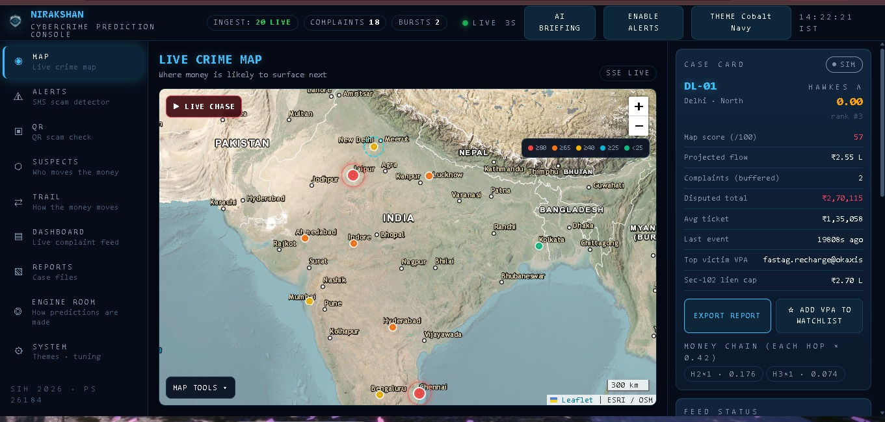
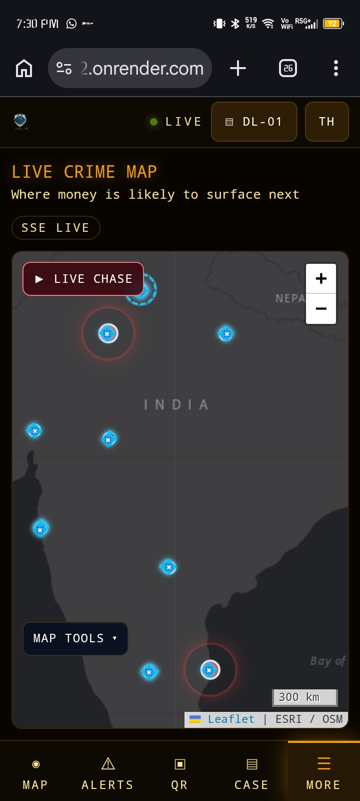
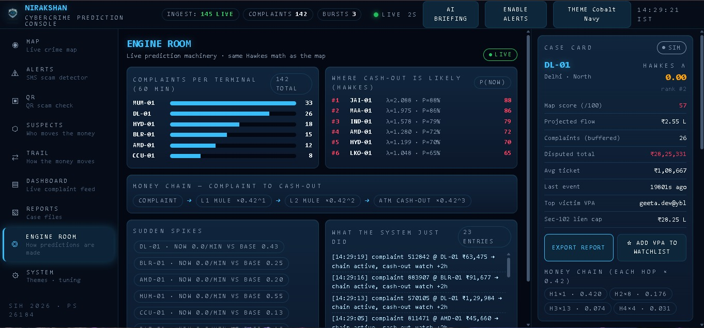
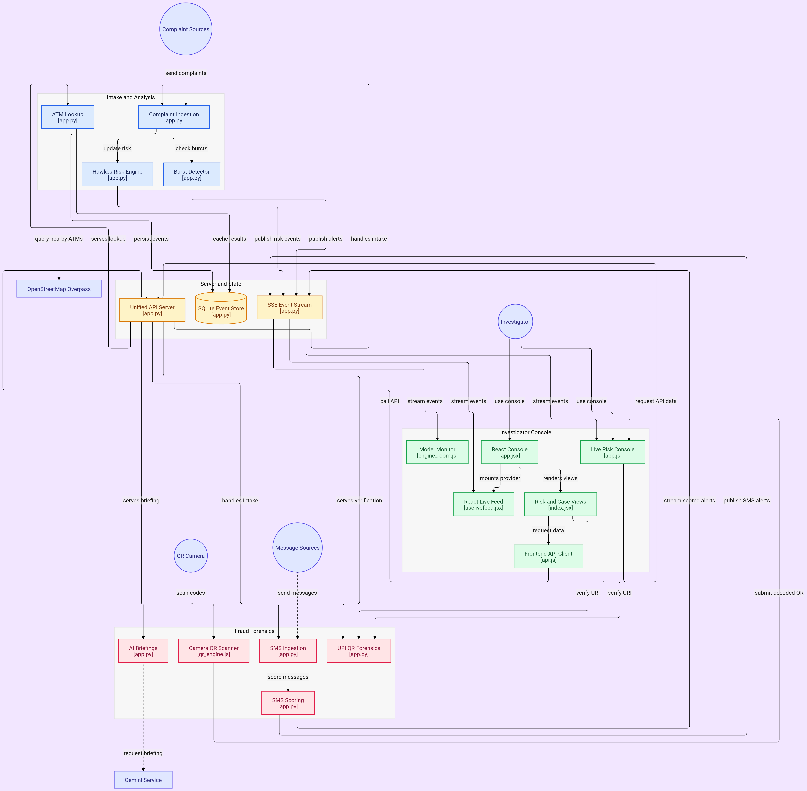

# NIRAKSHAN — Predictive Cybercrime Intelligence Console

### SIH 2026 · PS 26184 (MHA) — Forecasting likely cash-withdrawal locations from cybercrime complaint streams

> "We watch, so you're safe."

**Live:** https://nirikshanv2.onrender.com *(first visit: ~8s cinematic boot sequence, once per session)*
**Demo video:** https://youtu.be/27NCGUmb9SQ

Interactive architecture diagram: [gitdiagram.com/Yosa-Shiawase/Nirikshanv2](https://gitdiagram.com/Yosa-Shiawase/Nirikshanv2)

## What NIRAKSHAN does

Cyber-fraud money reaches an ATM within hours. Police find out after it's
gone. NIRAKSHAN flips that: it ingests cybercrime complaint streams live,
predicts which ATM clusters will be hit next (+2h/+6h/+24h), shows the real
ATMs to pre-position at, scans QR payments for fraud at the entry point, and
accepts scam reports from citizens — alarming operators across two channels.

## Round 2 highlights
- **Rebuilt frontend** — React 18 + Vite + Tailwind: desktop command console + dedicated mobile app layout (bottom nav, bottom sheets), one codebase
- **ENGINE ROOM** — a live pane exposing the prediction machinery: complaint intake bars, Hawkes λ/P ranking, chain anatomy with α^hop decay, spike-vs-baseline burst watch, self-narrating decision log
- **MAP TOOLS** — every map control consolidated into one grouped panel; functional UPI-volume and fraud-incident layers; glowing 💠 ATM markers
- **Live citizen channel** — Telegram bot scores scam SMS reports, alarms operators, replies verdicts to the reporter
- **Per-node dossiers** — EXPORT REPORT from any map node's case card (Section-102 BNSS, disputed-value-only liens)
- **7 themes** — including Daylight mode and animated RGB Pulse (contrast-measured at every animation phase)
- **Branded offline 404** — sonar-sweep page served by a service worker when the connection dies
- **Security hardening** — CORS restricted, per-IP rate limits, optional ingest key, security headers, 8KB body caps

## Architecture
[SIM NCRP stream + bursts]──┐
[Telegram bot reports]──────┼──> app.py (one stdlib Python file)
[QR camera / paste]─────────┘ │
├─ SQLite (complaints, sms, atm_cache)
├─ SSE /events ──> live dashboard + map pulses
├─ /atms ────────> real ATMs (OSM Overpass, 6h cache)
├─ /qr/verify ───> NPCI-rule UPI forensics
├─ /ai/briefing ─> LLM briefing (Gemini / rules fallback)
└─ /health
Frontend: React 18 + Vite + Tailwind (webapp/), legacy console preserved at /legacy/

## Capability provenance
| Capability | Status |
|---|---|
| Hawkes spatio-temporal risk engine | ✅ Real math — self-exciting process, α^hop attenuation, spatial kernel |
| Live ingestion (SSE) + SQLite | ✅ Real pipeline, queryable history |
| ATM/bank withdrawal layer | ✅ Real data — OpenStreetMap Overpass, dual-endpoint failover |
| QR fraud forensics | ✅ Real NPCI-rule engine — PSP allowlist, SE-keywords, watchlist |
| Camera QR scanning | ✅ Native BarcodeDetector + ZXing fallback, torch/zoom |
| EWMA burst anomaly detector | ✅ Unsupervised, live stream |
| LLM briefings | ✅ Gemini (optional) with rules fallback |
| Citizen SMS reports (Telegram) | ✅ Live — scored, alarmed, verdict-replied |
| Responsive dual layout | ✅ Desktop 3-zone console + mobile app layout, one codebase |
| NCRP complaint stream | 🟡 Simulated adapter — no public API; drop-in swap when granted |

## Server files
| File | Role |
|---|---|
| `app.py` | **Production** — entire backend in one stdlib-only file |
| `webapp/` | React frontend (source + committed `dist/`) |
| `public/` | Legacy vanilla console (served at `/legacy/`) |

## Security
Zero third-party dependencies (no supply-chain surface) · CORS restricted to deployment origin · per-IP rate limiting on write and expensive-read endpoints · optional ingest key · security headers (nosniff, DENY, no-referrer) · secrets via environment variables only · no PII stored.

## Stack
Frontend: React 18 + Vite + Tailwind. Backend: Python stdlib only. Hosting: Render free tier, auto-deploy on push (CI/CD). Monitoring: UptimeRobot.

## Run locally
